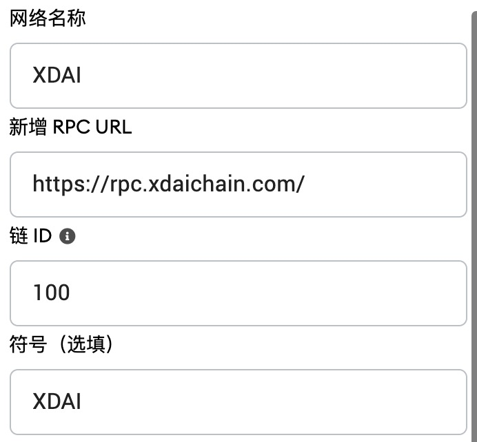
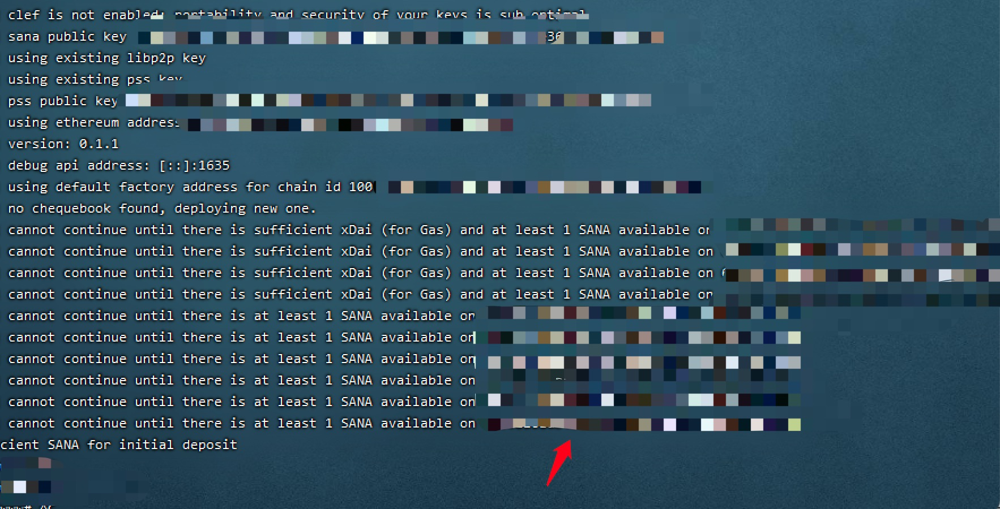

# SANA挖矿教程
## 基础信息
### 代币合约地址
#### ETH网络 ：[0x87cdc02f0812f08cd50f946793706fad9c265e2d](https://etherscan.io/token/0x87cdc02f0812f08cd50f946793706fad9c265e2d)

#### XDAI网络：[0x20cfc7c76c446F889E3969BeDEF46a950a2111F5](https://blockscout.com/xdai/mainnet/tokens/0x20cfc7c76c446F889E3969BeDEF46a950a2111F5)

#### SANA购买地址

[https://app.uniswap.org/](https://app.uniswap.org/)

### XDAI网络
#### RPC配置
|-------|----------------------------|
|-------|----------------------------|
| 网络名称  | XDAI                       |
| RPC地址 | https://rpc.xdaichain.com/ |
| 链ID   | 100                        |
| 符号    | Xdai                       |

#### MateMask配置



#### 跨链地址
|-------|----------------------------------------------------------------|
|-------|----------------------------------------------------------------|
| DAI跨链 | [https://bridge.xdaichain.com/](https://bridge.xdaichain.com/) |
| 代币跨链  | [https://omni.xdaichain.com/bridge](https://omni.xdaichain.com/bridge)                              |

#### RPC申请
注册网址
```
https://getblock.io/
```
注册完成后，根据下面的地址填充key，然后填入配置文件
```
https://stake.getblock.io/mainnet/?api_key=key
```

## SGX 安装配置
SGX仅支持intel平台，因为sana使用的inte_sgx，目前支持情况不佳，这里只提供部署方法，不提供硬件方案。
打开sgx功能
```
wget https://github.com/ethsana/sgx-tools/releases/download/0.1/sgx_enable
sudo chmod +x sgx_enable
sudo ./sgx_enable
```
安装sgx驱动
```
sudo wget https://download.01.org/intel-sgx/sgx-dcap/1.11/linux/distro/ubuntu18.04-server/sgx_linux_x64_driver_1.41.bin
sudo chmod +x sgx_linux_x64_driver_1.41.bin
sudo ./sgx_linux_x64_driver_1.41.bin
```
导入模块
```
/sbin/modprobe intel_sgx
```
如果出现一下错误说明机器不支持
```
modprobe: ERROR: could not insert 'intel_sgx': No such device
```
高于5.15的kernel已经支持sgx，不需要额外安装驱动。

## 二进制部署
#### 该脚本仅支持ubuntu运行
```shell
sudo wget https://raw.githubusercontent.com/espoir1989/sana-install/main/bin-install.sh
sudo sh bin-install.sh
```
脚本安装了，sana客户端ant，sana-dashboard，ExportKey私钥导出工具
安装完成后需要修改配置文件
```
password: "钱包密码" //钱包密码
swap-endpoint: https://rpc.xdaichain.com/ //rpc地址
dashboard-authorization: "test1234" //面板授权密码
```
修改完成后，可以使用screen在后台运行
sana启动命令
```
sudoant start --verbosity 5 --full-node --config /root/ant.yaml --debug-api-enable
```
输出一下信息后，需要将xdai网络中的xdai以及sana转入

转入后节点开始运行

## Docker部署
本脚本使用的镜像，未构建健康监测，请自行增加。
完善中......

## K8s部署
完善中......

## 私钥导出
```
ExportKey 路径 钱包密码
```

## 捐赠
ETH地址：0x1edBdb7828fb040bE54f8e1988b8E7a7f486B2e3
XDAI地址：0x1edBdb7828fb040bE54f8e1988b8E7a7f486B2e3

感谢捐赠，未来会提供更多的一键挖矿教程。
