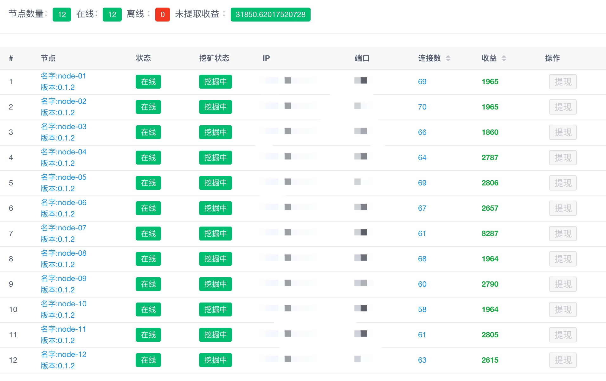

# SANA挖矿教程
## ！非官方教程，一键脚本仅适合未部署过的用户！github下载地址已经改为国内加速地址
## 基础信息
### 代币合约地址
#### ETH网络 ：[0x87cdc02f0812f08cd50f946793706fad9c265e2d](https://etherscan.io/token/0x87cdc02f0812f08cd50f946793706fad9c265e2d)

#### XDAI网络：[0x20cfc7c76c446F889E3969BeDEF46a950a2111F5](https://blockscout.com/xdai/mainnet/tokens/0x20cfc7c76c446F889E3969BeDEF46a950a2111F5)

#### SANA购买地址

[https://app.uniswap.org/](https://app.uniswap.org/)

### XDAI网络
#### RPC配置
|-------|----------------------------|
|-------|----------------------------|
| 网络名称  | XDAI                       |
| RPC地址 | https://rpc.xdaichain.com/ |
| 链ID   | 100                        |
| 符号    | Xdai                       |

#### MateMask配置


#### 跨链地址
|-------|----------------------------------------------------------------|
|-------|----------------------------------------------------------------|
| DAI跨链 | [https://bridge.xdaichain.com/](https://bridge.xdaichain.com/) |
| 代币跨链  | [https://omni.xdaichain.com/bridge](https://omni.xdaichain.com/bridge)                              |

#### RPC申请
注册网址
```
https://getblock.io/
```
注册完成后，根据下面的地址填充key，然后填入配置文件
```
https://stake.getblock.io/mainnet/?api_key=key
```
## SEV 安装配置
#### 需要 AMD Naples/Rome Epyc 系列的CPU，并在主板中打开sev与sem的开关
```
vim /etc/default/grub
```
在GRUB_CMDLINE_LINUX_DEFAULT中增加
```
mem_encrypt=on kvm_amd.sev=1
```
修改完成后重启服务器

#### 验证，输出一下数据为开启成功
```
ubuntu@nsXXX:~# dmesg | grep SME
[    1.247928] AMD Secure Memory Encryption (SME) active
```

```
ubuntu@nsXXX:~# dmesg | grep "SEV supported"
[    7.637219] SVM: SEV supported
```
```
ubuntu@nsXXX:~# cat /sys/module/kvm_amd/parameters/sev
1
```

## SGX 安装配置
SGX仅支持intel平台，因为sana使用的inte_sgx，目前支持情况不佳，这里只提供部署方法，不提供硬件方案。

打开sgx功能
```
wget https://github.91chifun.workers.dev/https://github.com/ethsana/sgx-tools/releases/download/0.1/sgx_enable
sudo chmod +x sgx_enable
sudo ./sgx_enable
```
安装sgx驱动
```
sudo wget https://download.01.org/intel-sgx/sgx-dcap/1.11/linux/distro/ubuntu18.04-server/sgx_linux_x64_driver_1.41.bin
sudo chmod +x sgx_linux_x64_driver_1.41.bin
sudo ./sgx_linux_x64_driver_1.41.bin
```
导入模块
```
/sbin/modprobe intel_sgx
```
如果出现一下错误说明机器不支持
```
modprobe: ERROR: could not insert 'intel_sgx': No such device
```
高于5.15的kernel已经支持sgx，不需要额外安装驱动。

## 二进制部署
#### 该脚本仅支持ubuntu运行
```shell
sudo wget https://raw.githubusercontent.com/espoir1989/sana-install/main/bin-install.sh
sudo sh bin-install.sh
```
脚本安装了，sana客户端ant，sana-dashboard，ExportKey私钥导出工具
安装完成后需要修改配置文件
```
password: "钱包密码" //钱包密码
swap-endpoint: https://rpc.xdaichain.com/ //rpc地址
dashboard-authorization: "test1234" //面板授权密码
```
修改完成后，可以使用screen在后台运行
sana启动命令
```
sudo ant start --verbosity 5 --full-node --config /root/ant.yaml --debug-api-enable
```
输出一下信息后，需要将xdai网络中的xdai以及sana转入

转入后节点开始运行

## Docker部署
本脚本使用的镜像，未构建健康监测，请自行增加。
```
docker pull expoir1989/sana:v0.1.3
```
下载配置文件
```
https://github.com/espoir1989/sana-install/raw/main/ant.yaml
```
修改配置文件
```
password: "钱包密码" //钱包密码
swap-endpoint: https://rpc.xdaichain.com/ //rpc地址
dashboard-authorization: "test1234" //面板授权密码
```
启动镜像
```
docker run -d --restart=always -p 1633:1633 -p 1634:1634 -p 1635:1635 -v /root/ant.yaml:/root/ant.yaml -v /home/ant:/home/ant  --name sana expoir1989/sana:v0.1.3 ant start --verbosity 5 --full-node --config /root/ant.yaml --debug-api-enable
```
查看日志
```
docker logs -f sana
```
根据提示转入xdai以及sana

## Docker一键部署部署
#### 请自行安装docker运行环境
docker 安装教程
[https://docs.docker.com/engine/install/](https://docs.docker.com/engine/install/)

一键部署请执行以下命令

```
wget https://raw.githubusercontent.com/espoir1989/sana-install/main/one-docker.sh

/bin/bash one-docker.sh
```
根据提示输入钱包密码与面板授权密码，该脚本会安装私钥导出程序以及面板。

## Docker 批量部署
#### 请在root权限下运行
```
sudo su
```
#### 下载并修改配置文件
```
cd /root
wget https://github.com/espoir1989/sana-install/raw/main/ant.yaml
```
```
password: "钱包密码"
dashboard-authorization: "api鉴权密码"
```
#### 开启容器
```
mkdir -p /data/001 /data/002 /data/003 /data/004 /data/005
docker run -d --restart=always -p 1633:1633 -p 1634:1634 -p 1635:1635 -v /root/ant.yaml:/root/ant.yaml -v /data/001:/home/ant  --name sana-001 expoir1989/sana:v0.1.3 ant start --verbosity 5 --full-node --config /root/ant.yaml --debug-api-enable
docker run -d --restart=always -p 1643:1633 -p 1644:1634 -p 1645:1635 -v /root/ant.yaml:/root/ant.yaml -v /data/002:/home/ant  --name sana-002 expoir1989/sana:v0.1.3 ant start --verbosity 5 --full-node --config /root/ant.yaml --debug-api-enable
docker run -d --restart=always -p 1653:1633 -p 1654:1634 -p 1655:1635 -v /root/ant.yaml:/root/ant.yaml -v /data/003:/home/ant  --name sana-003 expoir1989/sana:v0.1.3 ant start --verbosity 5 --full-node --config /root/ant.yaml --debug-api-enable
docker run -d --restart=always -p 1663:1633 -p 1664:1634 -p 1665:1635 -v /root/ant.yaml:/root/ant.yaml -v /data/004:/home/ant  --name sana-004 expoir1989/sana:v0.1.3 ant start --verbosity 5 --full-node --config /root/ant.yaml --debug-api-enable
docker run -d --restart=always -p 1673:1633 -p 1674:1634 -p 1675:1635 -v /root/ant.yaml:/root/ant.yaml -v /data/005:/home/ant  --name sana-005 expoir1989/sana:v0.1.3 ant start --verbosity 5 --full-node --config /root/ant.yaml --debug-api-enable
```
依次查看log并质押代币
```
docker logs -f sana-001
```
```
docker logs -f sana-002
```
```
docker logs -f sana-003
```
```
docker logs -f sana-004
```
```
docker logs -f sana-005
```

## K8s部署
完善中......

## 官方Docker镜像
```
docker pull ethsana/ant:v0.1.3
```

## Dashboard
安装脚本已经安装了nginx，本地直接访问
```
http://localhost
```
服务器或者vps部署
```
http://IP地址
```

#### 独立安装dashboard
仅限未安装nginx，并且未使用一键安装的场景
```
apt install zip unzip curl wget nginx screen vim -y
wget https://github.91chifun.workers.dev/https://github.com/ethsana/ant-dashboard/archive/refs/heads/online.zip
unzip online.zip
rm -rf /var/www/html/*
cp -r ant-dashboard-online/* /var/www/html/
service nginx restart
```

## 群控面板
根据部分用户需求开发了一个本地化的群控面板


## 私钥导出
#### 二进制导出
```
wget https://github.91chifun.workers.dev/https://github.com/ethsana/exportSanaKey/releases/download/v0.1.0/export-sana-key-linux-amd64
mv export-sana-key-linux-amd64 /usr/bin/ExportKey
chmod -R 777 /usr/bin/ExportKey
ExportKey keys文件夹路径 钱包密码
```
#### 源码执行，自行安装golang环境
```
git clone https://github.com/ethsana/exportSanaKey
cd exportSanaKey/pkg
go run main.go keys文件夹路径 钱包密码
```

## API
#### 节点状态
授权状态
```
curl -s localhost:1615/status -H 'Authorization: 授权码'
```
非授权状态
```
curl -s localhost:1615/status
```
#### 挖矿状态查询
授权状态
```
curl -s localhost:1635/mine/status -H 'Authorization: 授权码'
```
非授权状态
```
curl -s localhost:1635/mine/status
```
#### 提取收益
授权状态
```
curl -s -X POST http://localhost:1635/mine/withdraw -H 'Authorization: 授权码'
```
非授权状态
```
curl -s -X POST http://localhost:1635/mine/withdraw
```
#### 提取质押币，提取后解锁需要7天，这7天无收益
授权状态
```
curl -s -X POST http://localhost:1635/mine/cashdeposit -H 'Authorization: 授权码'
```
非授权状态
```
curl -s -X POST http://localhost:1635/mine/cashdeposit
```
7天后执行提取
```
待完善
```

## 备份
#### 请完整备份一下三个目录，缺一不可！
```
keys
localstore
statestore
```

## 节点数据恢复
#### 如果遇到重复质押，或者节点无法提取收益的情况，可以用修复工具进行修复
```
wget https://github.91chifun.workers.dev/https://github.com/ethsana/repair-chequebook/releases/download/v0.1.0/repair-chequebook-linux-amd64
mv repair-chequebook-linux-amd64 /usr/bin/repair-chequebook
chmod +X /usr/bin/repair-chequebook
```
新建一个文件夹，并且开始创建新数据
```
mkdir new
repair-chequebook new/ 创建账本的hash rpc地址
```
修复完成后核对账本地址，并将节点钱包的keys文件夹复制进来，使用该数据启动节点

## 节点db修复
#### 遇到节点unwork，查询区块链浏览器后，发现异常pending的请求，请使用该工具修复
本版本为临时版本，旨在官方发布正式版本前，为db异常的用户，提供数据修复
正式运行请使用官方版本，介意的用户，请自行编译或者等待官方releases，本为不为该版本承担任何责任

请在执行前，先终止异常的节点

md5sum
4fb22b84b5956d8c9a38e44e92eace56

#### 使用教程，请在执行前备份数据
```
wget https://github.com/espoir1989/sana-install/releases/download/0.1.3-db-espoir1989/ant
./ant db resetnonce --data-dir 数据目录
```

#### 国内下载
```
wget https://github.91chifun.workers.dev/https://github.com/espoir1989/sana-install/releases/download/0.1.3-db-espoir1989/ant
./ant db resetnonce --data-dir 数据目录
```

## RPC-docker部署
#### 预留60G以上的可用空间
```
mkdir /home/openethereum
chmod -R 777 /home/openethereum
docker run --restart=always -d --name xdai-node \
 -v /home/openethereum:/home/openethereum/.local/share/io.parity.ethereum/ \
 -p 8545:8545 -p 8546:8546   -p 30302:30303  \
 -p 30302:30303/udp openethereum/openethereum:latest \
 --jsonrpc-interface all --ws-interface all \
 --max-peers 1000  --jsonrpc-threads=100 --jsonrpc-cors=all --jsonrpc-server-threads=16 --chain xdai
```
/home/openethereum 为数据存储目录，请根据本地磁盘情况修改。
国内同步区块需要3-7天，国外需要1-5天，带机量如果较大，请使用配置较高的机器。
最近比较忙，空下来会提供一份离线数据包，大约50G，可以加速区块同步。

## XDAI 手机钱包

[TP钱包教程](https://www.chainnews.com/articles/691156556396.htm)

## 付费服务
#### 节点搭建，tee搭建，群控面板，tee服务器租用，技术咨询
#### 请联系[telegram](https://t.me/chouyan666)

## 捐赠

ETH地址：0x1edBdb7828fb040bE54f8e1988b8E7a7f486B2e3

XDAI地址：0x1edBdb7828fb040bE54f8e1988b8E7a7f486B2e3

感谢捐赠，未来会提供更多的一键挖矿教程。