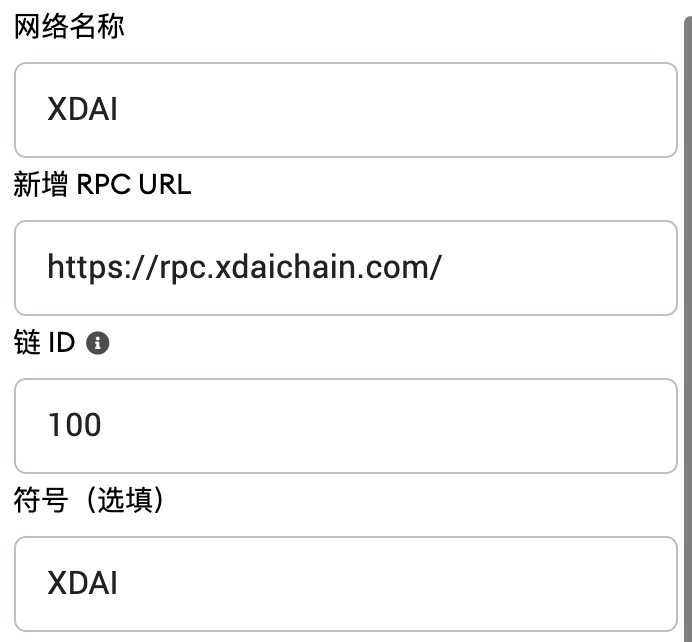
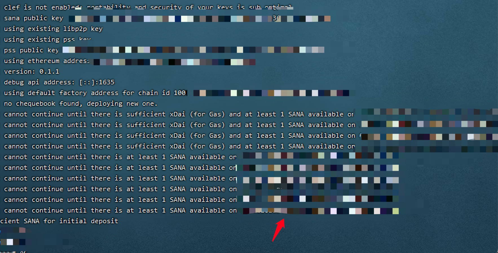

# SANA Mining Tutorial
## ！Unofficial Tutorial ！
## Basic information
### Token contract address
#### The ETH network ：[0x87cdc02f0812f08cd50f946793706fad9c265e2d](https://etherscan.io/token/0x87cdc02f0812f08cd50f946793706fad9c265e2d)

#### XDAI network：[0x20cfc7c76c446F889E3969BeDEF46a950a2111F5](https://blockscout.com/xdai/mainnet/tokens/0x20cfc7c76c446F889E3969BeDEF46a950a2111F5)

#### SANA purchase

[https://app.uniswap.org/](https://app.uniswap.org/)

### XDAI network
#### RPC configuration
|-------|----------------------------|
|-------|----------------------------|
| Network name  | XDAI                       |
| RPC Address | https://rpc.xdaichain.com/ |
| ChainID   | 100                        |
| symbol    | Xdai                       |

#### MateMask configuration



#### Across the link address
|-------|----------------------------------------------------------------|
|-------|----------------------------------------------------------------|
| DAI | [https://bridge.xdaichain.com/](https://bridge.xdaichain.com/) |
| Token  | [https://omni.xdaichain.com/bridge](https://omni.xdaichain.com/bridge)                              |

#### RPC application
Registered address
```
https://getblock.io/
```
Once the registration is complete, fill in the key according to the address below, and then fill in the configuration file
```
https://stake.getblock.io/mainnet/?api_key=key
```

## SGX Install the configuration
SGX supports only Intel platforms, because Sana uses inte_SGx, which is not well supported at present. The deployment method is provided here, but the hardware solution is not provided.

Turn on the SGX function
```
wget https://github.com/ethsana/sgx-tools/releases/download/0.1/sgx_enable
sudo chmod +x sgx_enable
sudo ./sgx_enable
```
Install the SGX driver
```
sudo wget https://download.01.org/intel-sgx/sgx-dcap/1.11/linux/distro/ubuntu18.04-server/sgx_linux_x64_driver_1.41.bin
sudo chmod +x sgx_linux_x64_driver_1.41.bin
sudo ./sgx_linux_x64_driver_1.41.bin
```
import module
```
/sbin/modprobe intel_sgx
```
If the following error occurs, the machine is not supported
```
modprobe: ERROR: could not insert 'intel_sgx': No such device
```
The kernel higher than 5.15 already supports SGX, so no additional driver installation is required.

## Binary deployment
#### This bash only works in Ubuntu
```shell
sudo wget https://raw.githubusercontent.com/espoir1989/sana-install/main/bin-install.sh
sudo sh bin-install.sh
```
The script is installed. The Sana client Ant, Sana -dashboard, and ExportKey private key export tool are installed
After the installation is complete, modify the configuration file
```
password: "wallet password" //wallet password
swap-endpoint: https://rpc.xdaichain.com/ //rpc address
dashboard-authorization: "test1234" //Panel Authorization password
```
Once the changes are complete, you can use Screen to run in the background
Sana Start command
```
sudo ant start --verbosity 5 --full-node --config /root/ant.yaml --debug-api-enable
```
After the output, you need to transfer xDAI and Sana from the XDAI network

After the roll-in, the node starts to run

## Docker deployment
The image used in this script is not built for health monitoring. Please add it by yourself.
```
docker pull expoir1989/sana:v0.1.1
```
Downloading a Configuration File
```
https://github.com/espoir1989/sana-install/raw/main/ant.yaml
```
Modifying a Configuration File
```
password: "wallet password" //wallet password
swap-endpoint: https://rpc.xdaichain.com/ //rpc address
dashboard-authorization: "test1234" //Panel Authorization password
```
Boot image
```
docker run -d --restart=always -p 1633:1633 -p 1634:1634 -p 1635:1635 -v /root/ant.yaml:/root/ant.yaml -v /home/ant:/home/ant  --name sana expoir1989/sana ant start --verbosity 5 --full-node --config /root/.ant.yaml --debug-api-enable
```
See the log
```
docker logs -f sana
```
Follow the prompts to transfer to XDAI and Sana

## K8s deployment
Perfect...

## Dashboard
The installation script has nginx installed and is accessible locally
```
http://localhost
```
Server or VPS deployment
```
http://IP
```

## private key export
```
ExportKey Path walletpassword
```

## donation

ETH Address：0x1edBdb7828fb040bE54f8e1988b8E7a7f486B2e3

XDAI Address：0x1edBdb7828fb040bE54f8e1988b8E7a7f486B2e3

Thanks for donations, more one-click mining tutorials will be provided in the future.